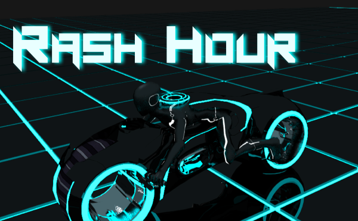
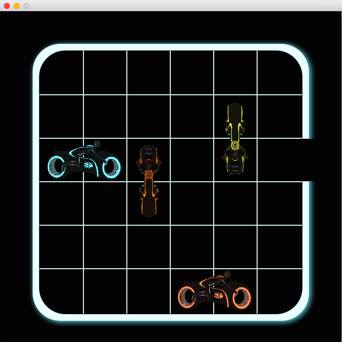

# Rash Hour
Tron legacy版のラッシュアワーゲーム。授業のTA業務のために、1週間で作ったシンプルなゲーム（MVCモデル、最小限のコード）です。

## 実行方法
	$ make
	$ make test

## 環境
- 言語： Java8

## ゲーム画面

## 作者
Tasuku TAKAHASHI ([supertask](http://github.com/supertask/))